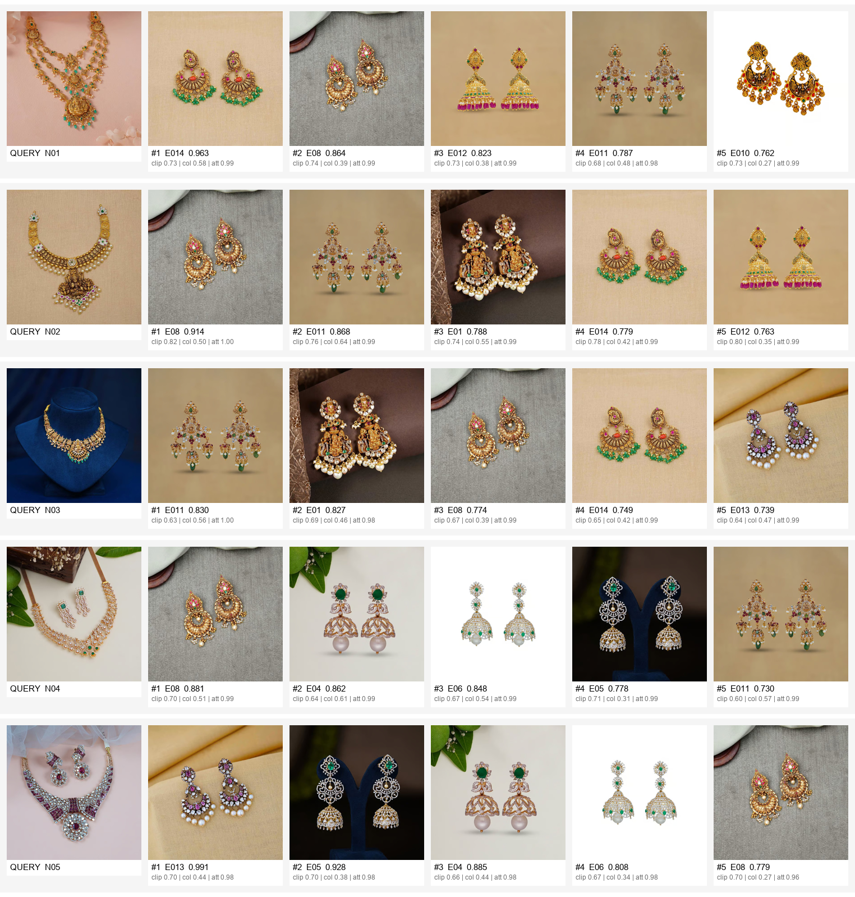

# Jewellery Match — earrings for a selected necklace

Given a necklace image, recommend the earrings from the inventory that visually
go with it. Prototype: one small library + a CLI + a FastAPI endpoint with a demo UI.



---

## How images are compared

Matching jewellery is not just "nearest image" — what makes a necklace and a pair of
earrings look like a *set* is **metal tone, stone palette, motif/style and visual
weight**. The score blends three complementary signals, each measuring one of those.

### 0. Preprocessing (`src/preprocess.py`) — done to every image first
The photos sit on wildly different backgrounds (pink card, navy velvet bust, wood +
leaves, grey cloth). Raw pixels would match on background and lighting, so:

`rembg` (U²-Net) background removal → keep largest component → crop to the object →
pad to square → resize to 224. Falls back to OpenCV GrabCut if `rembg` is missing.
Colour statistics are taken only from the object mask.

### 1. Fashion-CLIP embedding similarity — weight **0.55**
Image encoder of [`patrickjohncyh/fashion-clip`](https://huggingface.co/patrickjohncyh/fashion-clip),
a CLIP ViT-B/32 fine-tuned on ~700k fashion product image/text pairs. Its embedding
space already clusters jewellery by material, motif and silhouette far better than a
plain ImageNet backbone. Compared with **cosine similarity**. This is the main driver
of style/motif matching (temple ↔ temple, diamond ↔ diamond).

### 2. Colour-palette similarity — weight **0.30**
Top-5 dominant colours of the masked object via **k-means in CIELAB** (perceptually
uniform), each weighted by how much of the object it covers. Two palettes are
compared with a symmetric weighted nearest-colour distance (an approximate Earth
Mover's Distance), then mapped to `[0,1]` with `exp(-d/22)`. This is what keeps an
antique matte-gold necklace away from a bright rhodium/white AD earring even when the
shapes rhyme, and rewards shared accent colours (green/red temple stones, ruby+white).

### 3. Zero-shot attribute agreement — weight **0.15**
Fashion-CLIP text probes along 3 axes — **metal tone** (antique gold / bright gold /
rose / white-rhodium), **stone palette** (diamond-AD / emerald / ruby / polki-kundan /
plain-pearl), **style** (South-Indian temple / kundan-polki / modern-diamond /
minimalist). Each axis becomes a probability distribution; agreement is the
**Bhattacharyya coefficient**, averaged over axes. Cheap, and it yields the
human-readable "why it matched" chips shown in the UI and contact sheets.

### Combining
For a query necklace, each signal is computed against all 15 earrings, **min-max
normalised across those 15** (so every query uses the full 0–1 range), damped if the
raw spread is tiny, then `0.55·clip + 0.30·colour + 0.15·attr`. Earrings sorted by
the final score. Weights are in `src/features.py` (`WEIGHTS`) — tuned by eyeballing
all 5 necklaces.

### Why an ensemble
CLIP alone occasionally matches a silver piece to a gold one because the motifs are
alike; colour alone ignores craftsmanship and style. Together they agree on the
obvious matches and the colour term breaks CLIP's ties sensibly. The attribute term
adds a small, interpretable nudge and the explanation chips.

---

## Results on the provided inventory

| Necklace | Top-5 earrings (score) |
|---|---|
| **N01** antique gold temple, green beads | E014 (0.96), E08 (0.86), E012 (0.82), E011 (0.79), E010 (0.76) |
| **N02** antique gold Lakshmi, pearls | E08 (0.91), E011 (0.87), E01 (0.79), E014 (0.78), E012 (0.76) |
| **N03** antique gold Lakshmi choker | E011 (0.83), E01 (0.83), E08 (0.77), E014 (0.75), E013 (0.74) |
| **N04** diamond/AD with emeralds | E08 (0.88), E04 (0.86), E06 (0.85), E05 (0.78), E011 (0.73) |
| **N05** ruby + white AD victorian | E013 (0.99), E05 (0.93), E04 (0.89), E06 (0.81), E08 (0.78) |

Per-query contact sheets with score breakdowns are in [`outputs/`](outputs/).

---

## Run it

```bash
python -m venv .venv && .venv\Scripts\activate      # Windows
pip install -r requirements.txt

python precompute.py                                # build outputs/index.pkl (once)
```

### CLI (`recommend.py`)
```bash
python recommend.py --necklace N01 --top 5          # necklace from the inventory
python recommend.py --image path/to/necklace.jpg    # any external necklace photo
python recommend.py --all                           # contact sheet for every necklace
```
Prints JSON and writes `outputs/reco_<id>.png`.

### API + demo UI (`app.py`)
```bash
uvicorn app:app --reload
# open http://127.0.0.1:8000  — pick a necklace or upload one, see ranked earrings
```

| Method | Endpoint | |
|---|---|---|
| GET | `/api/recommend?necklace_id=N01&top=5` | rank for an inventory necklace |
| POST | `/api/recommend` (multipart `file`, `top`) | rank for an uploaded necklace image |
| GET | `/api/products` | full inventory |
| GET | `/images/{id}` | product image |

Example response:
```json
{
  "query": { "id": "N01", "why": ["metal tone: antique matte gold", "stone palette: green emerald stones", "style: South Indian temple ..."] },
  "weights": { "clip": 0.55, "colour": 0.30, "attr": 0.15 },
  "results": [
    { "rank": 1, "id": "E014", "score": 0.963,
      "breakdown": { "clip": 0.73, "colour": 0.58, "attr": 0.99 },
      "why": ["metal tone: antique matte gold", "stone palette: green emerald stones", "style: South Indian temple ..."] }
  ]
}
```

---

## Tech

| | |
|---|---|
| Embeddings | `transformers` + `torch` — Fashion-CLIP (CLIP ViT-B/32) |
| Segmentation | `rembg` (U²-Net), OpenCV GrabCut fallback |
| Colour | `scikit-learn` k-means, OpenCV RGB→LAB |
| API / UI | `FastAPI` + `uvicorn`, vanilla HTML/JS |
| Rendering | `Pillow` contact sheets |

CPU-only is fine (20 images, a few seconds). CUDA is used automatically if present.

---

## Limitations & next steps
- 5 necklaces / 15 earrings, no ground-truth pairs — evaluation is qualitative.
- Segmentation isn't perfect when a shot contains extra props (N04 has leaves + a
  second item); a tighter detector would help.
- Weights are hand-tuned. With click/purchase data this becomes a learn-to-rank problem.
- "Matching" is approximated by visual similarity; a real system would also model
  *complementarity* (scale balance, not being a near-duplicate of the pendant).
- Could add: explicit metal-tone classifier, shape/symmetry descriptors, and
  fine-tuning Fashion-CLIP on jewellery set pairs.
